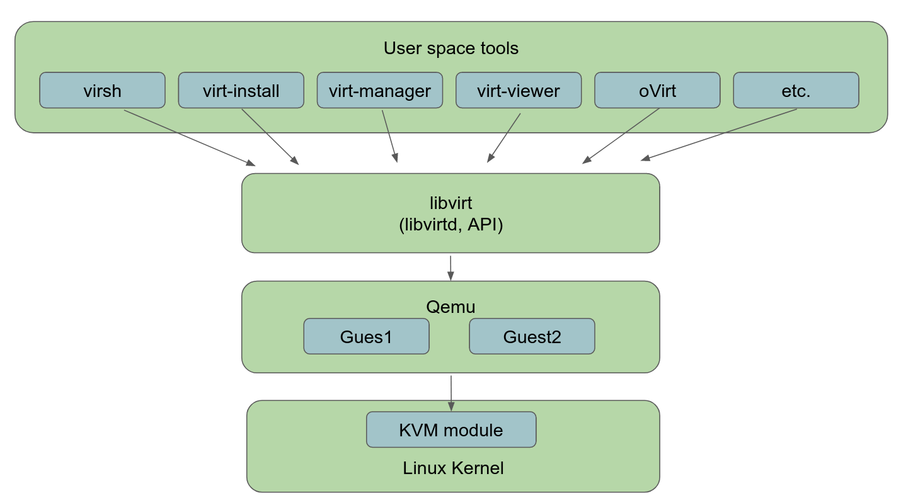

# Introduzione a KVM

<p align="center">
    
</p>

## Cosa significa "virtualizzazione"

Volendo sintetizzare al massimo, si potrebbe dire che la virtualizzazione sia *"una tecnologia che
permette di creare risorse virtuali e di mapparle logicamente a risorse fisiche, creando un layer
di astrazione aggiuntivo separato dall'hardware fisico"*.Detto in altre parole, la virtualizzazione
permette di eseguire diversi sistemi operativi in parallelo sulla stessa macchina fisica, spesso
(non sempre, dipende dalla tecnologia usata) senza che questi siano "consapevoli" di essere eseguiti
in una macchina virtuale. I risvolti che l'utilizzo di questa tecnologia ha (e continua ad avere) nel
mondo dell'Information Technology sono enormi.

## Vantaggi della virtualizzazione

Chi approccia la virtualizzazione per la prima volta, non di rado arriva a porsi la domanda "d'accordo,
possiamo creare una macchina virtuale che viene eseguita all'interno (o "sopra") una macchina fisica,
ma quali sono i vantaggi?"

### Ho eliminato l'hardware fisico?

No ovviamente, l'hardware non può essere eliminato. La macchina host
avrà sempre bisogno di avere CPU, RAM, storage, network etc.

### Ho semplificato l'amministrazione del sistema operativo o delle applicazioni?

No, neppure.
La macchina, anche se virtuale, ha comunque bisogno che il suo sistema operativo abbia le corrette configurazioni,
e lo stesso vale per le applicazioni. Ad esempio: se devo installare un server web, il fatto che sia virtualizzato
in sè non semplifica la configurazione di Apache. Anzi, potrebbe addirittura complicarla: l'interfaccia di rete della
macchina virtuale, ad esempio, è collegata ad una Virtual Network, un layer software ulteriore che si aggiunge alla
configurazione dell'interfaccia fisica della macchina host e che va amministrato.

Ma il bilancio, se si fermasse qui, sarebbe estremamente parziale, perché la virtualizzazione può portare
enormi vantaggi rispetto ad un approccio in cui tutto è fisico. Per citarne alcuni:

* **Consolidamento delle risorse**

   Il dimensionamento di un server che deve erogare un servizio o eseguire
un'applicazione può essere complicato. E' molto difficile valutare esattamente le risorse necessarie e,
quasi sempre, un server fisico si ritrova con risorse inutilizzate per gran parte del tempo. Grazie alla
virtualizzazione, possiamo trarre vantaggio di queste risorse libere: se il server ha potenza computazionale
residua, perché non aggiungere altre macchine virtuali che possano sfruttarle ed erogare servizi aggiuntivi?
Il risparmio economico e la razionalizzazione delle risorse possono essere enormi.

* **Backup**

  La virtualizzazione permette di creare backup e snapshot di tutta la nostra infrastruttura
con estrema facilità, rendendo anche la sperimentazione di nuove soluzioni molto più agile. Creo uno snapshot,
testo alcune modifiche o una nuova configurazione e, se ne ho bisogno, posso far tornare tutto allo stato
precedente in tempi brevissimi.

* **Deployment**

  Ci sono soluzioni come Red Hat Satellite e Ansible che rendono il deployment
di macchine anche fisiche un processo perlopiù automatico, ma la virtualizzazione ne moltiplca le capacità. Diventa
possibile definire non solo le configurazioni software, ma anche quelle "hardware" in maniera automatica. Sfruttando,
ad esempio, delle API, possiamo assegnare esattamente le risorse che ci servono su ogni macchina virtuale tramite una
logica implementata a livello software.

## Tipi di virtualizzazione

Nel panorama IT esistono diversi tipi di virtualizzazione, spesso categorizzati a seconda di *quello* che si vuole
virtualizzare (Desktop Virtualization, Server Virtualization, Application Virtualization etc.). Più spesso,
viene preso in considerazione il "metodo" usato per creare macchine virtuali. Alcuni esempi di tipi di virtualizzazione
sono:

* **Partitioning**

    La CPU è divisa in più parti e ognuna lavora individualmente in maniera isolata e può
eseguire un sistem opartivo diverso (come le IBM Logical Partitions - LPARs)

* **Full Virtualization**

  L'hardware della macchina virtuale è emulato in maniera trasparente, così che
il sistema operativo *guest* non sia consapevole di essere eseguito in una macchina virtuale (e quindi,
non abbia bisogno di essere modificato rispetto a quello che viene eseguito in una macchina fisica).
La *Full Virtualization* può essere ottenuta sia via software, traducendo al volo l'instruction set dei
binari eseguiti dalla macchina *guest* (è un processo costoso in termini di risorse), sia via hardware,
se la CPU della macchina host supporta la virtualizzazione (AMD-V o Intel VT). KVM sfrutta questa tecnologia.

* **Paravirtualization**

  La macchina *guest* esegue una versione modificata del sistema operativo e dei
driver che le permettono di venire eseguita senza bisogno delle estensioni di virtualizzazione della CPU.

Ci sono poi anche approcci ibridi e i container (che permettono la virtualizzazione delle singole
applicazioni e di tutte le loro dipendenze senza però bisogno di virtualizzare anche il kernel e l'intero sistema
operativo).

## Hypervisor

La virtualizzazione ha sempre bisogno di un software che si occupi della creazione e gestione dell'hardware
virtuale, la creazione e gestione delle singole virtual machines, l'allocazione delle risorse, la mappatura
I/O etc. Questo software è un elemento critico della virtualizzazione ed è chiamato *Virtual Machine Manager
(VMM)* o **hypervisor**. In breve, l'hypervisor viene eseguito direttamente sulla macchina fisica (*host*) e
ha il compito di gestire in ogni suo aspetto le macchine virtuali (*guest*). Esistono principalemente 2 tipi
di hypervisor, distinti sulla base del livello a cui operano rispetto all'hardware fisico (anche se la linea
di demarcazione non è così netta e potrebbe essere oggetto di dibattito...):

* **Type 1 Hypervisor**

  Il software dell'hypervisor viene eseguito direttamente sulla macchina fisica (in altre
parole, *è* il sistema operativo dell'*host*) ed interagisce direttamente con l'hardware. Alcuni esempi di questo
tipo sono *VMware ESXi*, *Citrix XenServer*, *Microsoft Hyper-V* e *KVM*, che di fatto rende il kernel della macchina
*host* un hypervisor. Questo tipo di hypervisor è detto anche *bare-metal*

<p align="center">
    
</p>

* **Type 2 Hypervisor**

  La macchina *host* ha un sistema operativo sul quale viene eseguito un software di
virtualizzazione. Hypervisor di questo tipo sono *Oracle VirtualBox* e *VMware Workstation/Player*

<p align="center">
    
</p>

## KVM, QEMU e LIBVIRT

Approcciando KVM ci si rende presro conto che i componenti in gioco sono più di uno, e non è sempre semplice
farsi un'idea corretta di quale sia la loro funzione all'interno dello stack software e hardware coinvolto
nel processo di virtualizzazione.
Al livello più basso, un ruolo fondamentale è ricoperto dalla CPU (fisica) sulla quale creiamo l'ambiente
virtualizzato (ovvero, la CPU della macchina che fa da hypervisor). Sia i processori Intel che AMD hanno
introdotto - una quindicina di anni fa - delle feature specifiche dedicate appositamente alla virtualizzazione:

### Intel VT / AMD-V

Sono un'estensione del set di istruzioni del processore e dei livelli di accesso privilegiato (viene introdotto
il "ring -1") che permettono al sistema operativo virtualizzato di eseguire istruzioni privilegiate (kernel mode)
senza bisogno che l'hypervisor esegua una traduzione delle istruzioni a runtime, aumentando notevolmente le prestazioni.
Queste estensioni devono essere, nella maggior parte delle schede madri, esplicitamente abilitate nel BIOS/UEFI
dell'hypervisor

## KVM

Per poter sfruttare questo set di istruzioni, il kernel Linux utilizza i moduli **kvm** (kvm.ko, kvm-intel.ko, kvm-amd.ko).
Questi moduli sono generalmente caricati dal kernel automaticamente se la CPU espone le funzionalità di virtualizzazione
(Intel VT / AMD-V). Per confermare che i moduli siano attivi, si può fare un `lsmod`:

```bash
[user@linux]lsmod | grep kvm
kvm_amd               118784  0
kvm                   835584  1 kvm_amd
ccp                   102400  1 kvm_amd

```

I moduli KVM, una volta caricati, espongono un nuovo dispositivo, `/dev/kvm`, che le applicazioni di virtualizzazione possono
utilizzare per interagire con il set di istruzioni esteso della CPU tramite syscall dirette (*ioctl()*). Nel nostro caso, il
software di virtualizzazione è *QEMU*.

## QEMU

QEMU è un software che ha la capacità di creare hardware emulato (CPU, dischi, rete, periferiche PCI e uSUB etc.). Quando però
viene usato assieme a KVM (QEMU-KVM), è in grado di trarre vantaggio di `/dev/kvm`, rendendo l'emulazione della CPU molto
performante grazie ai set di istruzioni estese Intel e AMD. QEMU è in grado anche di creare e inizializzare macchine virtuali,
diventando a tutti gli effetti in software di virtualizzazione completo.

## LIBVIRT

Ora che abbiamo una CPU in grado di accelerare la virtualizzazione grazie a set di istruzioni dedicate, un modulo del kernel
un software di che ci permette di trarne vantaggio (**KVM**), un software di virtualizzazione completo in grado di creare
macchine virtuali dotate di tutte le periferiche emulate di cui hanno bisogno (**QEMU**), abbiamo bisogno di un'interfaccia
per poter creare, amministrare, modificare etc. le nostre macchine virtuali. Anche se, tecnicamente, QEMU potrebbe essere
amministrato direttamente eseguendolo direttamente da terminale e passandogli i parametri corretti, *libvirt* mette a disposizione
degli amministratori di sistema delle API stabili che si occupano di fare i conti con li software di virtualizzazione sottostante.
E' in grado, grazie all'implementazione di diversi driver, di fornire un layer di astrazione per diversi software di virtualizzazione.
Chi volesse prendersi il tempo di guardare il codice sorgente di libvirt, troverebbe tutte queste implementazioni di driver (qemu_driver.c,
xen_driver.c, xenapi_driver.c, vmware_driver.c, vbox_driver.c etc.), che corrispondono ad altrettanti software di virtualizzazione.
Queste API, messe a disposizione da libvirt tramite il demone `libvirtd`, possono essere sfruttate usando una serie di utility da
terminale (`virsh`, `virt-install`, etc.) o utility grafiche (Gnome virt-manager, Gnome boxes, Cockpit etc.)
Come vedremo più avanti, quando l'ambiente virtuale diventa complesso e le macchine numerose, un software come *oVirt* permette una
gestione più avanzata e scalabile, ma le API con cui si interfaccia sono API di *libvirt*

Per riassumere, potremmo rappresentare lo stack (con alcune semplificazioni) in questo modo:

<p align="center">
    
</p>


## CREARE UNA VIRTUAL MACHINE

Anche se il resto del corso si concentrerà su **oVirt**, è comunque utile utilizzare le API di libvirt con i tool da linea di comando
per familiarizzare con quello che avviene quando si crea una virtual machine.

Il comando che useremo sarà `virt-install`. Avremo bisogno di scaricare la ISO di un sistema operativo che useremo come installer,
nel nostro caso CentOS 8.3, e copiarlo sul filesystem (ad esempio, in `/var/lib/libvirt/images/`). Per assegnare alla macchina virtuale
4GB di RAM, 2 CPU e un hard disk da 16GB, il comando è:

```bash

virt-install --virt-type=kvm \
--name=CentOSVM \
--ram 4096 --vcpus 2 \
--os-variant=rhel8.3 \
--cdrom=/var/lib/libvirt/images/CentOS-8.3.2011-x86_64-minimal.iso \
--network=default --graphics vnc --disk size=16

```

Virt-install, una volta creata la macchina virtuale, lancerà automaticamente virt-viewer collegato alla console dell'istanza appena
creata:

<p align="center">
    
</p>

Ma cosa è avvenuto "sotto"? Se apriamo un altro terminale e controlliamo i processi attivi, vedremo che la nostra macchina virtuale
altro non è che un processo di `qemu-system-x86_64` - che è il binario Qemu per l'architettura x86 - lanciato da `libvirt` - con una
lunghissima serie di parametri che ci fanno ben capire perché sia preferibile utilizzare un tool di alto livello (libvirt o, come
vedremo, oVirt) che si occupi di gestire Qemu invece che interagire direttamente. Tra i vari parametri, troveremo anche `accel=kvm`
, che ci conferma che Qemu sta sfuttando pienamente il modulo KVM (e quindi `/dev/kvm`) per incremetare le prestazioni della virtualizzazione;

```bash

ps aux | grep qemu

libvirt+   27369  9.9 12.3 5132860 4057416 ?     Sl   14:25   0:50 /usr/bin/qemu-system-x86_64 -name guest=CentOSVM [...], accel=kvm, [...]

