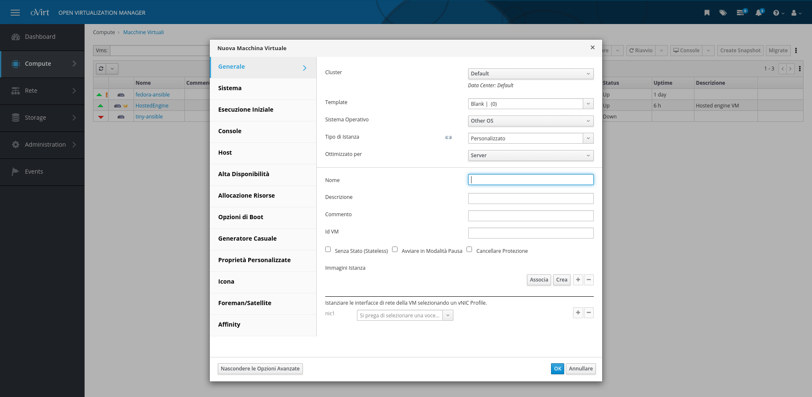

# Amministrazione di oVirt

In questo paragrafo vedremo come, una volta installato il nostro cluster di prova, possiamo iniziare a creare delle macchine virtuali per iniziare a lavorare sul nostro oVirt/RHV.


## Creazione macchina virtuale

Per creare la nostra macchina virtuale dobbiamo, come prima cosa, andare a scegliere l'immagine della macchina virtuale da utilizzare e caricarla sulla piattaforma. Per fare questo andiamo su  **Storage > Dischi** e selezionare Upload:


Dalla stessa schermata possiamo anche andare a definire un disco per da utiliazzare per la nostra VM (ci basterà selezionare Nuovo dal menù):


Una volta caricata la iso, possiamo iniziare a creare la nostra macchina virtuale. Per farlo possiamo andare sotto **Compute > Virtual Machines** e selezionare **Nuovo**:


Qui ci si aprirà una schermata in cui possiamo andare a definire Nome, Tipo di OS, Immagine Istanza, le NIC di rete viste dalla macchina virtuale, ecc.





Se vogliamo aggiungere dello storage alla nostra macchina virtuale, possiamo farlo direttamente qui o andando creare il disco virtuale che ospiterà i dati della vm. Una volta creata la macchina virtuale, troveremo la nostra macchina in stato di °up°. Per collegarci alla nostra macchina ci basterà andare a utilizzare il tasto *Console* per aprire una sessione SPICE con la macchina remota:

![]

Questo farà partire il download di un file contenente la configurazione per la connessione, possiamo utilizzare questo file con software come virt-viewer.

## Ansible

  Tutto questo procedimento, però, è molto macchinoso e necessita di molte configurazioni manuali, che vanno bene se vado a fare una installazione di 1/2 macchine virtuali. Se voglio scalare il numero di macchine virtuali, gestire in modo più ottimale la creazione e configuzione delle vm, allora possiamo andare ad utilizzare Ansible con l'uso delle Ansible Collections per oVirt.
  
### Ansible Collections

Le Ansible Collections sono il nuovo modo con cui Ansible va a rendere disponibile i moduli e plugin, in modo da separe il ciclo di sviluppo da quello delle funzionalità core di Ansible.

### oVirt Collections

Cosa possiamo fare con le collection per oVirt? In realtà possiamo fare un po' di tutto:

- Creazione VM
- Creazione dischi
- Caricare iso/dischi nei vari  Storage Domani
- Creazione template
- Configurazioni del cluster
- Aggiunta di nodi
- Gestione del cluster
- ecc...

### oVirt Collection: Creazione VM

Vediamo un playbook d'esempio per poter creare una serie di VM con le collection di ansible.


```yaml
---
- name: Create a simple vm
  hosts: localhost
  gather_facts: False
  
  # Con la lista collections andiamo ad indicare quali collection andiamo ad importare durante l'esecuzione del nostro playbook,
  # in questo modo non saremo obbligati ad invocare ogni modulo come 'ovirt.ovirt.[nome modulo]' ma semplicemente con il nome del
  # modulo desiderato.
  collections:
    - ovirt.ovirt
  vars:
    # E' assolutamente più indicato tenere le variabili contentente le credenziali in un file di Ansible Vault e non in chiaro
    # come in questo esempio! Qui vengono tenuto solo per avere a portata di sguardo durante l'esempio
    ovirt_username: admin@internal
    ovirt_pwd: admin
    ovirt_url: https://engine.ovirt/ovirt-engine/api
    
    # E' anche più indicato avere le definizioni delle varibili esternamente al playbook stesso, in modo da averlo più riutilizzabile
    # possible. Sono qui incluse per le stesse considerazioni precedenti
    vms:
      - name: tiny
        tag: test
        disk_size: 1GiB
        memory: 1GiB
        iso: Tiny.iso
        n_cores: 1
        nic: nic1

      - name: fedora
        tag: prod
        disk_size: 30GiB
        memory: 2GiB
        iso: Fedora.iso
        n_cores: 2
        nic: nic2
    
    # Le immagini devono essere scaricate in locale prima di eseguire questo playbook:
    # Prima immagine: [Fedora Silverblue](https://getfedora.org/it/silverblue/)
    # Seconda immagine: [512-byte-vm](https://github.com/oVirt/512-byte-vm)
    images:
      - name: Fedora.iso
        size: 2.6GiB
        path: ./Fedora-Silverblue-ostree-x86_64-34-1.2.iso

      - name: Tiny.iso
        size: 1.8MiB
        path: ./512-byte-vm.iso
  tasks:

    # Questo passo è necessario per creare il token di autenticazione verso ovirt.

    - name: authenticate with ovirt
      ovirt_auth:
        url: "{{ ovirt_url }}"
        username: "{{ ovirt_username }}"
        password: "{{ ovirt_pwd }}"
    
    - name: copy images on ovirt
      loop: "{{ images }}"
      ovirt_disk:
        auth: "{{ ovirt_auth }}"
        name: "{{ item.name }}"
        storage_domain: IsoDomain
        content_type: iso
        wait: true
        format: raw
        upload_image_path: "{{ item.path }}"


    - name: creation of storage
      loop: "{{ vms }}"
      ovirt_disk:
          auth: "{{ ovirt_auth }}"
          name: "{{ item.name }}-ansible-disk"
          size: "{{ item.disk_size }}"
          state: present
          storage_domain: StorageExample

    - name: creation of a tiny vm
      loop: "{{ vms }}"
      ovirt_vm:
        auth: "{{ ovirt_auth }}"
        name:  "{{ item.name }}-ansible"
        cluster: Default
        state: running
        cd_iso: "{{ item.iso }}"
        memory: "{{ item.memory }}"
        cpu_cores: 1
        boot_devices:
          - cdrom
        nics:
          - profile_name: ovirtmgmt
            name: "{{ item.nic }}"
    
    # Con questa invocazione andiamo a settare dei tag sulle VM; i tag sono visibili a livello di oVirt, questo ci torna utile ad esempio
    # quando andiamo a utilizzare inventory dinamiche per le vm create.
    - name: creation of a tag on vm
      loop: "{{ vms }}"
      ovirt_tag:
        auth: "{{ ovirt_auth }}"
        name: "{{ item.tag }}"
        vms:
          - "{{ item.name }}-ansible"

    - name: delete token auth
      ovirt_auth:
        state: absent
        ovirt_auth: "{{ ovirt_auth }}"
```

### oVirt Collections: Plugin per Inventory

Bene, abbiamo creato le nostre macchine virtuali. Ora, se vogliamo andare a configurare queste macchine virtuali tramite ansible dobbiamo prendere il loro ip/hostname e metterlo nell'inventory che verrà utilizzata, giusto?

No, o meglio, non è il modo più corretto. In questo caso abbiamo una piattaforma che conosce tutte le informazioni che volgiamo richiedere e che le rende disponbili tramite delle API, le stesse API che ansible va a contattare quando viene utilizzato un modulo. Come facciamo ad utilizzare queste API per avere la lista delle VM disponibili? Ci basta utilizzare l'inventory plugin messo a disposizione della collections di ovirt!

Cosa è un inventory plugin?
Un inventory plugin funziona allo stesso modo di uno script per un inventory dinamico, ma va a configurare il plugin per richiedere gli host direttamente alla piattaforma. Per utilizzarlo poi ci basterà utilizzarlo come un file inventory classico.

Qui sotto un esempito della configuratione del plugin per oVirt:

```yaml
# nome del plugin da utilizzare
plugin: ovirt.ovirt.ovirt
# credenziali per le api di oVirt
ovirt_url: https://engine.ovirt/ovirt-engine/api
ovirt_username: admin@internal
ovirt_password: admin
keyed_groups:
  - key: cluster
    prefix: 'cluster'
# I gruppi di host da generare, in questo caso partendo dai tag assegnati alle varie vm
groups:
  test: "'test' in tags"
  prod: "'prod' in tags"
```

